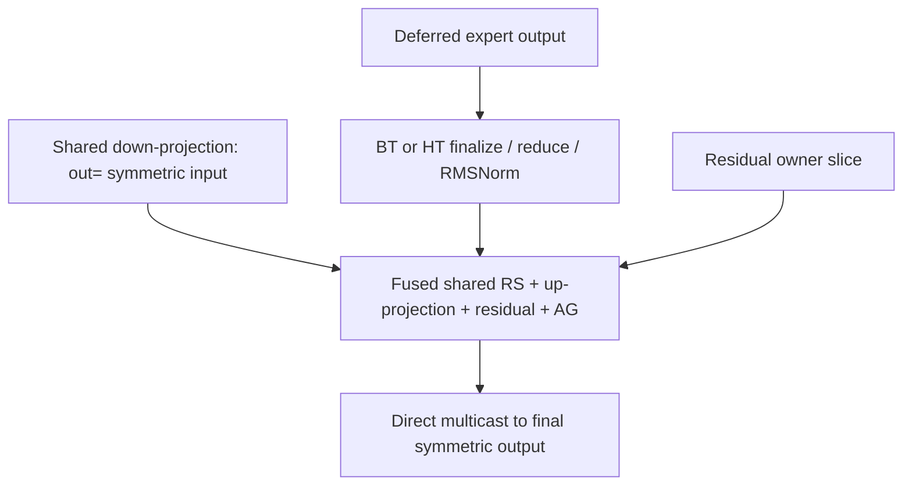

# Integrated K3 MoE tail design

This default-off profile has a completed single-pair serving measurement,
not replicated performance or full-model numerical qualification.
`TOKENSPEED_K3_INTEGRATED_FUSED_TAIL=1` enables both first-stage protocols and
the same fused shared-RS/up-projection/residual/AG device pattern. It is mutually
exclusive with the historical first-only and medium-only flags.
The old M4096/M8192-only entry point is removed. Setting its obsolete
`TOKENSPEED_K3_FUSED_RS_UP_AG` flag is rejected collectively; use
`TOKENSPEED_K3_INTEGRATED_FUSED_TAIL` for the continuous-range path.

| Kernel M | First stage | Second stage |
| --- | --- | --- |
| 0..32 | Existing empty/small route | Existing empty/small route |
| 33..1024 | Deferred BT finalize/AR/RMSNorm | Fused RS/up/residual/AG |
| 1025..8192 | Deferred HT finalize/AR/RMSNorm, ten stages | Fused RS/up/residual/AG |
| Above 8192 | Existing separate path | Existing separate path |

The selector uses continuous intervals on actual kernel M; a graph dispatches
on its padded M using the existing graph ladder. Eager and graph forwards use
the same selector and live-pointer launcher, including speculative forwards.
No optimized-range fallback is permitted after integrated initialization.
Capability disagreement fails before collective allocation; missing in-range
plans fail rather than switching to an AllReduce control.

Both comparison arms explicitly set `--prefill-graph-max-tokens 8192`. The
original agentic benchmark does not mandate 2048: it omits the option and
inherits a runtime default. This profile neither changes that default nor the
benchmark client, workload, request counts, KVStore or speculative settings.

## Tuning and memory

The inherited medium specialization changes host geometry only. M33..512 uses
one-CTA 64x64; M513..1024 one-CTA 64x128. These retain
automatic A/B/C stages. M1025..8192 uses two-CTA 256x128, AB6/C3/ACC2; the
persistent cluster cap is 38 through 4096 and queried capacity above 4096.
All use one addend stage, four independent reductions and static-persistent
scheduling. Interpolation is a candidate policy, not a measured optimality claim.

The M256 two-CTA short-screen result was less than one percent faster than
one-CTA 64x64, without a repeated cluster-only comparison. That is insufficient
evidence for a separate low-M two-CTA interval. The integrated profile therefore
uses one CTA throughout M33..1024. This is a simplicity choice among close
screened configurations, not proof of noise or a universal small-batch rule.
Historical endpoint-only measurements refer to earlier revisions, not a retained
serving entry point in this branch.

One raw symmetric workspace and two 8192x7168 BF16 symmetric outputs are
shared by sequential layers. Global layer-index parity selects the output;
each layer still owns its weight-dependent launch cache. Both outputs together
require 224 MiB, versus 10304 MiB for the original 92 per-layer outputs.
This is a 10080 MiB allocation reduction. The pooled serving measurement
reports 51.00 GiB KV per GPU versus 51.58 GiB for same-run main, compared with
40.97 GiB in the historical per-layer candidate.
The original two-batch campaign uses the old per-layer allocation and does not
qualify this revised ownership policy.

The previous layer's output can remain the current residual, so one output
would be unsafe. Two outputs keep it distinct from the current destination;
the existing live-input alias checks remain enabled. AttnRes block writes copy
into independent block storage, and EAGLE3/DFLASH taps clone or materialize their
results before later layers overwrite a slot. The existing entry rank barrier
orders all prior consumers before multicast reuse, and the exit barrier makes
the result visible before its next consumers. Auxiliary consumer streams must
join before reuse. No new copy or device barrier is introduced.

Allocate before KV sizing and retain both handles through every graph replay.
All graph buckets use fixed parity addresses and execute sequentially; outputs
are transient until the same slot is next written, not per-layer archives.
Different concurrent model/graph instances require separate storage. The
historical medium-only profile retains per-layer outputs.

## Dataflow and arithmetic



The first half produces replicated normalized latent [M,3584]. The second
half consumes rank-local up weight [896,3584], raw shared partial [M,7168]
and replicated residual [M,7168]. Each rank produces its896-column owner
slice and multicasts it into the replicated [M,7168] output.

Grouped128-bit multimem reductions feed shared addend stages while persistent
GEMM executes. The epilogue releases accumulators after their final read,
before waiting for output-stage reuse, then uses TMA multicast directly into
the final symmetric buffer. There is no shared staging copy, separate global
RS result or mailbox/AG materializer. A legacy shard allocation remains layout
metadata, not a produced intermediate. Overlap is inside the second stage;
stall-free MMA and overlap between both tail stages are not claimed.

Preserve these BF16 boundaries for each owned slice:

```text
shared = BF16(sum_ranks(raw_shared))
acc    = FP32(latent @ weight.T)
q      = BF16(acc + FP32(shared_owner))
out    = BF16(FP32(q) + FP32(residual_owner))
```

Residual is included once after reduction. Main pre-adds residual to the shared
owner before addmm and AllReduce #2, so bitwise equality to main is not promised.
System-level publication/acquire/release, proxy-alias fences and cross-rank
output completion remain. There is no rank barrier inside GEMM. Allocation,
rank agreement, occupancy checks and compilation precede capture; replay uses
live inputs without host collectives. The real shared producer writes the
exact symmetric `out=` view. Target verification follows the same M dispatch:
sixteen requests with four speculative tokens can use M64.

## Validation boundary

This performance campaign runs uninstrumented same-main comparisons directly;
independent adapter/full-model smoke and dedicated non-tile-multiple GPU
validation are deliberately omitted. Do not report those checks as passed.
The original gold warmup and runtime/device-error checks remain enabled.
Actual serving graph startup and replay are exercised by the benchmark, but
uninstrumented timing does not prove a complete per-bucket route inventory.
CPU interval tests verify routing only, not kernel memory safety or accuracy.
Preserve execution failures, source/container/config identities and numeric
results. Report local tail, all-turn gold TTFT and first-turn TTFT separately,
including speculative acceptance and KV-capacity differences. Performance
results alone do not establish numerical equivalence or model task quality.

Only kernel unit/correctness tests and their helpers are retained in this
branch; experiment drivers and result datasets are excluded. Tests cover BT/HT
references and graph replay, fused launch configuration, live input pointers,
guarded outputs and changed-input replay. The integrated correctness harness
supports `--pooled-outputs` for four layers sharing two physical outputs.
Its intermediate snapshots are correctness instrumentation, not serving copies.
Distributed tests require TP8 and are not substitutes for model-quality checks.

## Source map and attribution

Runtime integration is in `python/tokenspeed/runtime/models/kimi_k3_comm.py`.
Bindings live under `tokenspeed-kernel/python/tokenspeed_kernel/ops/communication/`;
fused device code is in `thirdparty/cute_dsl/symmetric_up_projection/` within
that package. Runtime uses only the `tokenspeed-kernel` boundary.

`ops/communication/fused_rs_workspace.py` owns the symmetric shared input,
retained shard-layout metadata and allocation-time rank checks. Serving bindings
and fused correctness tests share that workspace. The standalone CuTeDSL shared
RS and Triton hidden-dimension RS kernels, their launch/staging APIs and the
standalone RS tuning sweep are removed. Shared reduction remains inside the
fused GEMM; its entry/exit barriers, proxy-alias fences, allocation sizes and
M dispatch are unchanged. Existing generic Triton collectives remain available.

The endpoint-only facade, fixed-M configuration and separate cluster-cap binding
are removed. The common serving base retains live-pointer validation and launch
but cannot be instantiated; concrete profiles supply input views and compilation.
Integrated medium/large configurations and cluster caps still use the existing
continuous-range binder, with unchanged fused device code and output pooling.
The large-M correctness harness now checks that integrated adapter against the
same-profile fixed-input binding and the unchanged independent addmm/AllReduce
reference; M4096/M8192 remain test cases, not a dispatch whitelist.

The native H3584 HT specialization vendors FlashInfer's
`flashinfer/comm/mnnvl_cutedsl/kernel_ht/device_kernel.py` from v0.6.18,
commit `69ff11fc4954396d98326656dc85debd2223f637`, under its original Apache-2.0
license. Upstream file SHA256:
`076c6621d5456affa6c7255c868260a90904a3e4c624d18779d15f35a54c44a6`.
Original notices remain in source. The specialization uses ceiling-divided
reduction vectors and predicated multimem loads/stores: H3584/TP8 has448 BF16x8
packs and56 packs per shard. With two reduction warps, lanes56–63 issue no
load/store. This avoids H4096 padding copies and RMSNorm rescaling while
preserving the producer/consumer/RMSNorm geometry contract.
